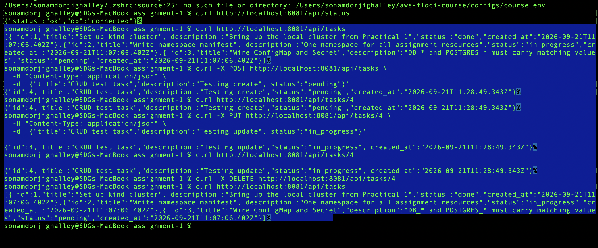
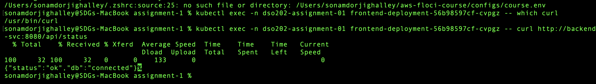
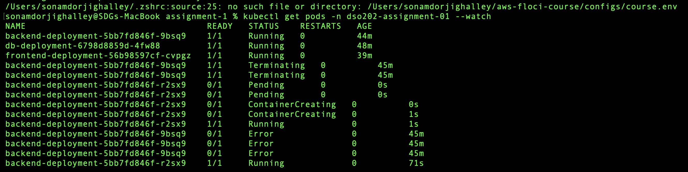
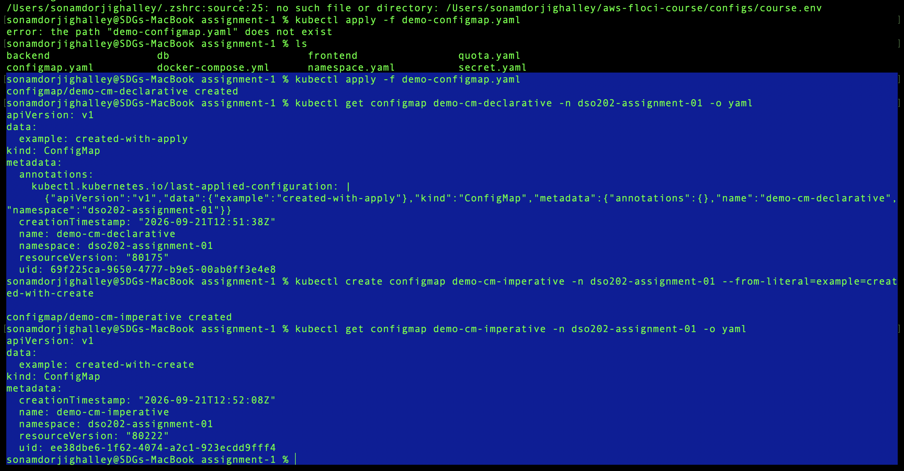

# DSO202 — Assignment 1: Three-Tier Application Deployment on Kubernetes Cluster

## 1. Architecture Note

### Control-plane and node components involved in scheduling and running each Pod

When `kubectl apply -f <manifest>` is run, the request travels through the following path for every Pod in this assignment:

```
kubectl  →  kube-apiserver  →  scheduler  →  kubelet  →  container runtime  →  Pod
```

- **kubectl** — the CLI client. It serializes the manifest to JSON and sends an HTTPS request to the API server. It performs no cluster logic itself.
- **kube-apiserver** — the single entry point to the cluster. It authenticates the request, validates the manifest against the Kubernetes schema, and persists the desired state to `etcd`. Every other component only ever talks to the API server, never directly to each other.
- **scheduler (kube-scheduler)** — watches for Pods that exist in `etcd` but have no Node assigned. It picks a suitable Node based on available CPU/memory (respecting this namespace's `ResourceQuota`/`LimitRange`) and binds the Pod to that Node.
- **kubelet** — the agent running on the chosen Node (in `kind`, this is the `dso202-p2-control-plane` container acting as both control-plane and worker, since this is a single-node kind cluster). It watches the API server for Pods assigned to its Node and instructs the container runtime to start them.
- **container runtime (containerd, used by kind)** — actually pulls the image (or in this case, uses the image already loaded via `kind load docker-image`) and starts the container process.
- **Pod** — the running unit that results from this chain. Each of the three tiers here (frontend, backend, database) runs as exactly one Pod per Deployment (`replicas: 1`), since the assignment is a single-instance teaching deployment.

### Kubernetes objects used per tier, and why

| Tier | Objects used | Why |
|---|---|---|
| Namespace | `Namespace` | Isolates all assignment resources (`dso202-assignment-01`) from anything else in the cluster — multi-tenancy in miniature. |
| Frontend | `Deployment`, `Service (NodePort)` | Deployment gives self-healing (ReplicaSet keeps 1/1 Pods alive) and declarative rollout. NodePort is the only Service type that can expose a Pod outside the cluster without a cloud LoadBalancer, which `kind` doesn't provide. |
| Backend | `Deployment`, `Service (ClusterIP)`, `ConfigMap`, `Secret` | ClusterIP keeps the backend reachable only inside the cluster (never externally) — required by the assignment. ConfigMap/Secret decouple configuration and credentials from the container image. |
| Database | `Deployment` (replicas: 1), `Service (headless, clusterIP: None)`, `PersistentVolumeClaim`, `ConfigMap`, `Secret` | A headless Service is used instead of ClusterIP because a single-instance stateful workload doesn't need load-balancing — DNS resolves directly to the Pod IP. The PVC decouples data from the Pod's lifecycle, so Pod deletion/recreation doesn't destroy data (demonstrated in Task 7c). |
| Whole namespace | `ResourceQuota`, `LimitRange` | Prevent any one tier (or a runaway rollout) from consuming unbounded cluster resources; LimitRange supplies sane per-container defaults since none of the three Deployments hardcode `resources:` blocks. |

### Application flow

```
Browser
  → Frontend NodePort Service (frontend-svc:30080)
    → Frontend Pod (nginx serving static assets + injected BACKEND_URL)
      → Backend ClusterIP Service (backend-svc:8080)
        → Backend Pod (Node.js REST API)
          → Database headless Service (db-svc:5432)
            → Database Pod (PostgreSQL)
              → PersistentVolumeClaim (db-pvc, 1Gi, StorageClass: standard)
```

**Note on browser access:** the frontend's client-side JavaScript resolves `BACKEND_URL` (`http://backend-svc:8080`) directly in the *browser*. Since `backend-svc` only exists in Kubernetes' internal cluster DNS (CoreDNS), a browser running outside the cluster cannot resolve it — this produced an expected "Backend Unreachable / Failed to fetch" message when viewing the frontend UI directly. This is not a misconfiguration; it is the direct consequence of the backend correctly being ClusterIP-only, as required. All CRUD evidence for this submission was therefore captured via `curl` through a port-forwarded backend, as explicitly permitted by the assignment brief (Task 7a).

---

## 2. Repository Structure

```
assignment-1/
├── namespace.yaml
├── configmap.yaml
├── secret.yaml
├── quota.yaml
├── docker-compose.yml        
├── database (db)/
│   ├── Dockerfile
│   ├── init/01-init.sql
│   ├── pvc.yaml
│   ├── deployment.yaml
│   └── service.yaml
├── backend/
│   ├── Dockerfile
│   ├── package.json
│   ├── src/
│   │   ├── db.js
│   │   ├── routes/tasks.js
│   │   └── server.js
│   ├── deployment.yaml
│   └── service.yaml
├── frontend/
│   ├── Dockerfile
│   ├── docker-entrypoint.sh
│   ├── nginx.conf
│   ├── public/
│   │   ├── index.html
│   │   ├── app.js
│   │   ├── styles.css
│   │   └── config.js.template
│   ├── deployment.yaml
│   └── service.yaml
└── README.md
```

---

## 3. Namespace

`namespace.yaml` creates the dedicated namespace `dso202-assignment-01`, and every resource in this submission is scoped to it via `metadata.namespace`.

```yaml
apiVersion: v1
kind: Namespace
metadata:
  name: dso202-assignment-01
```

Verified live:
```
NAME                   STATUS   AGE
dso202-assignment-01   Active   3d1h
```

---

## 4. Configuration and Secret Explanation

### ConfigMap (`dso202-config`) — non-sensitive values

| Key | Value |
|---|---|
| `DB_HOST` | `db-svc` |
| `DB_PORT` | `5432` |
| `DB_NAME` | `taskdb` |
| `APP_PORT` | `8080` |
| `CORS_ORIGIN` | `*` |
| `POSTGRES_DB` | `taskdb` |
| `BACKEND_URL` | `http://backend-svc:8080` |

`DB_NAME` and `POSTGRES_DB` intentionally carry the **same value** (`taskdb`), since the backend and the official PostgreSQL image use different variable names for the same database.

### Secret (`dso202-secret`) — credential values

| Key | Purpose |
|---|---|
| `DB_USER` | consumed by the backend |
| `DB_PASSWORD` | consumed by the backend |
| `POSTGRES_USER` | consumed by the database container |
| `POSTGRES_PASSWORD` | consumed by the database container |

`DB_USER` = `POSTGRES_USER` and `DB_PASSWORD` = `POSTGRES_PASSWORD` (same underlying values, base64-encoded), so both tiers authenticate against the same PostgreSQL role.

### Why the `DB_*` / `POSTGRES_*` split exists

The backend application code was written expecting `DB_HOST`/`DB_PORT`/`DB_NAME`/`DB_USER`/`DB_PASSWORD`. The official PostgreSQL image expects its own convention: `POSTGRES_DB`/`POSTGRES_USER`/`POSTGRES_PASSWORD`. Both sets are supplied with matching values so each tier is correctly configured — copying only one set would leave the other tier broken.

**Kubernetes Secrets are base64-encoded, not encrypted at rest by default.** Base64 is an encoding, not encryption — anyone with `kubectl get secret -o yaml` access (or `etcd` access) can trivially decode the values. This is a documented limitation, not something this assignment attempts to fix (would require an external secrets manager, KMS-backed etcd encryption, or a tool like Sealed Secrets — out of scope for Unit I).

---

## 5. Database Tier

- **Image:** `dso202-db:v1`, built `FROM postgres:17.11-alpine`
- **Deployment:** `replicas: 1`, consumes `POSTGRES_DB` from the ConfigMap and `POSTGRES_USER`/`POSTGRES_PASSWORD` from the Secret — never the `DB_*` keys, since the official Postgres image doesn't understand them
- **Init script:** `init/01-init.sql` is copied into the image at `/docker-entrypoint-initdb.d/01-init.sql`, so PostgreSQL runs it automatically on first initialization — it creates the `tasks` table and seeds 3 sample rows
- **Storage:** a 1Gi `PersistentVolumeClaim` (`db-pvc`), using kind's default `standard` StorageClass, mounted at `/var/lib/postgresql/data`
- **Service:** `db-svc`, headless (`clusterIP: None`), port 5432, internal to the cluster only — never NodePort or LoadBalancer

**Verified:**
```
NAME     STATUS   VOLUME                                     CAPACITY   ACCESS MODES   STORAGECLASS
db-pvc   Bound    pvc-26d2e6da-422b-438e-8c08-3d82887d89ae   1Gi        RWO            standard
```
```
$ kubectl exec -n dso202-assignment-01 db-deployment-... -- psql -U dso202user -d taskdb -c '\dt'
          List of relations
 Schema | Name  | Type  |   Owner
--------+-------+-------+------------
 public | tasks | table | dso202user
(1 row)
```
Postgres log confirmed `CREATE TABLE`, `INSERT 0 3`, and `database system is ready to accept connections` with no errors.

---

## 6. Backend Tier

- **Image:** `dso202-backend:v1`, Node.js, `EXPOSE 8080`, runs `node src/server.js`
- **Reads from ConfigMap:** `DB_HOST`, `DB_PORT`, `DB_NAME`, `APP_PORT`, `CORS_ORIGIN`
- **Reads from Secret:** `DB_USER`, `DB_PASSWORD`
- **`DB_HOST` resolves to `db-svc`**, so the backend connects to the database purely by Service name, never a hardcoded IP
- **Service:** `backend-svc`, ClusterIP, port 8080 → targetPort 8080, never exposed outside the cluster
- **Endpoints:** `GET/POST /api/tasks`, `GET/PUT/DELETE /api/tasks/{id}`, `GET /api/status`

**Verified:**
```
$ curl http://localhost:8081/api/status
{"status":"ok","db":"connected"}
```
Pod reached `1/1 Running` with **zero restarts** on first apply — confirming the backend successfully connected to the database on first attempt without needing its documented retry/backoff logic to kick in repeatedly.

---

## 7. Frontend Tier

- **Image:** `dso202-frontend:v1`, `FROM nginx:1.27-alpine`
- **Runtime configuration:** `docker-entrypoint.sh` uses `envsubst` to render the `BACKEND_URL` environment variable into `public/config.js.template` → `config.js` at container start, so the backend address is never baked into the image at build time
- **Listens on** port 8080 internally (nginx configured for non-root, unprivileged port)
- **Service:** `frontend-svc`, NodePort, port 8080 → targetPort 8080

**NodePort access note:** `dso202-p2` was created without an `extraPortMappings` entry (confirmed via `docker port dso202-p2-control-plane`, which only showed the API server port `6443`). Per the assignment brief's Section 4 fallback, the frontend is therefore reached via:
```
kubectl port-forward -n dso202-assignment-01 svc/frontend-svc 8080:8080
```
rather than directly through the kind Docker container's NodePort.

---

## 8. ResourceQuota and LimitRange Justification

```yaml
apiVersion: v1
kind: ResourceQuota
metadata:
  name: dso202-quota
  namespace: dso202-assignment-01
spec:
  hard:
    pods: "6"
    requests.cpu: "1"
    requests.memory: 1Gi
    limits.cpu: "3"
    limits.memory: 3Gi
    persistentvolumeclaims: "2"
    requests.storage: 2Gi
---
apiVersion: v1
kind: LimitRange
metadata:
  name: dso202-limits
  namespace: dso202-assignment-01
spec:
  limits:
    - type: Container
      defaultRequest:
        cpu: 100m
        memory: 128Mi
      default:
        cpu: 500m
        memory: 512Mi
      max:
        cpu: "1"
        memory: 1Gi
```

**Justification:**
- Normally **3 application Pods** run (one per tier). `pods: "6"` gives headroom for a rolling update to briefly run 2 replicas of a tier during a deployment without hitting the quota.
- `requests.cpu: 1` / `requests.memory: 1Gi` comfortably covers 3 containers at the LimitRange's default request (`100m`/`128Mi` each = `300m`/`384Mi` total), with room to spare for a 4th Pod during a rollout.
- `limits.cpu: 3` / `limits.memory: 3Gi` bounds worst-case usage — even if every container hit its LimitRange default limit (`500m`/`512Mi`) simultaneously across up to 6 Pods, the namespace still can't exceed 3 CPU / 3Gi, preventing one misbehaving container from starving the Node.
- The LimitRange's `max` (`1` CPU / `1Gi` memory per container) stops any single container from being configured to consume the entire namespace quota by itself.
- `persistentvolumeclaims: "2"` / `requests.storage: 2Gi` allows the database's 1Gi PVC plus one spare, without allowing unbounded storage claims.
- These values are deliberately small but not tight enough to throttle normal operation of this Task Tracker app, which does trivial CRUD work with no heavy compute.

**Verified live usage (well within bounds):**
```
NAME           REQUEST                                                                          LIMIT
dso202-quota   persistentvolumeclaims: 1/2, pods: 3/6, requests.cpu: 300m/1, requests.memory: 384Mi/1Gi, requests.storage: 1Gi/2Gi   limits.cpu: 1500m/3, limits.memory: 1536Mi/3Gi
```

---

## 9. Deployment Procedure

Applied in this order, using declarative `kubectl apply -f`:

```bash
kubectl apply -f namespace.yaml
kubectl apply -f configmap.yaml
kubectl apply -f secret.yaml
kubectl apply -f quota.yaml
kubectl apply -f db/pvc.yaml
kubectl apply -f db/deployment.yaml
kubectl apply -f db/service.yaml
kubectl apply -f backend/deployment.yaml
kubectl apply -f backend/service.yaml
kubectl apply -f frontend/deployment.yaml
kubectl apply -f frontend/service.yaml
```

Before applying, all three images were built locally and loaded into the `dso202-p2` kind cluster (kind cannot see the local Docker daemon's images otherwise):

```bash
docker build -t dso202-db:v1 ./db
docker build -t dso202-backend:v1 ./backend
docker build -t dso202-frontend:v1 ./frontend

kind load docker-image dso202-db:v1 --name dso202-p2
kind load docker-image dso202-backend:v1 --name dso202-p2
kind load docker-image dso202-frontend:v1 --name dso202-p2
```

Each Deployment sets `imagePullPolicy: IfNotPresent` so Kubernetes uses the locally loaded image instead of attempting a registry pull.

---

## 10. Verification

```
$ kubectl get all -n dso202-assignment-01
NAME                                       READY   STATUS    RESTARTS   AGE
pod/backend-deployment-5bb7fd846f-gb7jz    1/1     Running   0          20m
pod/db-deployment-6798d8859d-4fw88         1/1     Running   0          107m
pod/frontend-deployment-56b98597cf-cvpgz   1/1     Running   0          98m

NAME                   TYPE        CLUSTER-IP      EXTERNAL-IP   PORT(S)          AGE
service/backend-svc    ClusterIP   10.96.116.20    <none>        8080/TCP         103m
service/db-svc         ClusterIP   None            <none>        5432/TCP         107m
service/frontend-svc   NodePort    10.96.206.132   <none>        8080:30080/TCP   97m

NAME                                  READY   UP-TO-DATE   AVAILABLE   AGE
deployment.apps/backend-deployment    1/1     1            1           103m
deployment.apps/db-deployment         1/1     1            1           107m
deployment.apps/frontend-deployment   1/1     1            1           98m
```

- All Pods `Running`, **zero restarts**
- `db-pvc` `Bound`
- ConfigMap `dso202-config` (7 keys) and Secret `dso202-secret` (4 keys) present
- ResourceQuota and LimitRange applied and enforcing correctly
- Every Pod/Deployment/Service carries the correct `tier` label (`frontend`, `backend`, or `database`) — confirmed via `--show-labels`
- No image uses `:latest` — confirmed via `kubectl get pods -o jsonpath` showing `dso202-backend:v1`, `dso202-db:v1`, `dso202-frontend:v1`

---

## 11. CRUD Evidence (Task 7a)

Performed via `curl` through `kubectl port-forward -n dso202-assignment-01 svc/backend-svc 8081:8080`, per the assignment's permitted fallback.

**CREATE**
```
$ curl -X POST http://localhost:8081/api/tasks -H "Content-Type: application/json" \
  -d '{"title":"CRUD test task","description":"Testing create","status":"pending"}'
{"id":4,"title":"CRUD test task","description":"Testing create","status":"pending","created_at":"2026-09-21T11:28:49.343Z"}
```

**READ**
```
$ curl http://localhost:8081/api/tasks/4
{"id":4,"title":"CRUD test task","description":"Testing create","status":"pending","created_at":"2026-09-21T11:28:49.343Z"}
```

**UPDATE**
```
$ curl -X PUT http://localhost:8081/api/tasks/4 -H "Content-Type: application/json" \
  -d '{"title":"CRUD test task","description":"Testing update","status":"in_progress"}'
{"id":4,"title":"CRUD test task","description":"Testing update","status":"in_progress","created_at":"2026-09-21T11:28:49.343Z"}
```

**DELETE**
```
$ curl -X DELETE http://localhost:8081/api/tasks/4
$ curl http://localhost:8081/api/tasks
# task id 4 no longer present — back to the original 3 seed tasks
```
**ScreenShot**


---

## 12. DNS Evidence (Task 7b)

From inside the frontend Pod, the backend Service was reached by **name**, not by Pod IP:

```
$ kubectl exec -n dso202-assignment-01 frontend-deployment-56b98597cf-cvpgz -- which curl
/usr/bin/curl

$ kubectl exec -n dso202-assignment-01 frontend-deployment-56b98597cf-cvpgz -- curl http://backend-svc:8080/api/status
{"status":"ok","db":"connected"}
```

This confirms Kubernetes cluster DNS (CoreDNS) correctly resolves `backend-svc` to the backend Pod's ClusterIP Service from within the cluster network namespace.

**Screenshot**


---

## 13. Self-Healing and Persistence Evidence (Task 7c)

Two tasks (`id: 5`, `id: 6`, both titled "Persistence test") were created before deleting the backend Pod manually — twice, to demonstrate repeatability.

**Pod replacement (watched via `kubectl get pods --watch`):**
```
backend-deployment-5bb7fd846f-r2sx9    1/1     Terminating   0          37m
backend-deployment-5bb7fd846f-gb7jz    0/1     Pending       0          0s
backend-deployment-5bb7fd846f-gb7jz    0/1     ContainerCreating   0          0s
backend-deployment-5bb7fd846f-gb7jz    1/1     Running             0          1s
```
The ReplicaSet automatically created a replacement Pod within ~1 second of the old one terminating — no manual intervention.

**Data persisted across the Pod replacement:**
```
$ curl http://localhost:8081/api/tasks
[..., {"id":5,"title":"Persistence test", ...}, {"id":6,"title":"Persistence test", ...}]
```
Tasks 5 and 6 remained present after the backend Pod was deleted and recreated, proving the application's data — stored in the database's `PersistentVolumeClaim` — is entirely independent of the backend Pod's lifecycle.

**Screenshot**


---

## 14. Declarative vs. Imperative Comparison (Task 7d)

A throwaway ConfigMap was created both ways in the same namespace, then deleted afterward to avoid cluttering the final resource list.

**Declarative:**
```bash
kubectl apply -f demo-configmap.yaml
```
```yaml
apiVersion: v1
kind: ConfigMap
metadata:
  name: demo-cm-declarative
  namespace: dso202-assignment-01
data:
  example: "created-with-apply"
```

**Imperative:**
```bash
kubectl create configmap demo-cm-imperative -n dso202-assignment-01 --from-literal=example=created-with-create
```
**Screenshot**



**Observed difference:** the declaratively-created ConfigMap automatically received a `kubectl.kubernetes.io/last-applied-configuration` annotation — Kubernetes' record of the desired state from the YAML file, used to compute future diffs on `apply`. The imperatively-created ConfigMap had no such annotation; it exists purely because the command was run once, with no file to diff against on a future change.

| | Declarative (`apply -f`) | Imperative (`create ...`) |
|---|---|---|
| Source of truth | YAML file — repeatable, diffable | The command itself — not repeatable without re-typing |
| Version control | Naturally fits (commit the YAML) | Nothing to commit except the command in a shell history |
| Best for | Production/infrastructure management | Quick, one-off manual actions |
| Kubernetes tracks prior state | Yes (`last-applied-configuration` annotation) | No |

---

## 15. Secret Encoding Caveat

**Kubernetes Secrets are base64-encoded, not encrypted at rest by default.** Anyone with API/`etcd` read access can trivially decode `dso202-secret`'s values with `base64 -d`. This is documented here as required by the assignment; addressing it (via KMS-backed etcd encryption, an external secrets manager, or sealed secrets) is outside Unit I's scope.

---

## 16. Troubleshooting Notes

| Symptom encountered | Cause | Resolution |
|---|---|---|
| `docker build` failed for frontend with a TLS handshake timeout on `nginx:1.31.3-alpine` | That nginx tag doesn't exist yet (current mainline was ~1.29.x at build time) — likely a typo/aspirational tag | Changed base image to `nginx:1.27-alpine`, a real, stable tag |
| Frontend UI showed "Backend Unreachable / Failed to fetch" in the browser | `BACKEND_URL` (`http://backend-svc:8080`) can only be DNS-resolved *inside* the cluster; the browser runs outside it | Not a bug — used `curl` through `kubectl port-forward` for CRUD evidence, as explicitly permitted by the assignment brief |
| No NodePort reachable directly from the browser | `dso202-p2` kind cluster was created without an `extraPortMappings` entry | Used `kubectl port-forward -n dso202-assignment-01 svc/frontend-svc 8080:8080` as the documented fallback |

---

